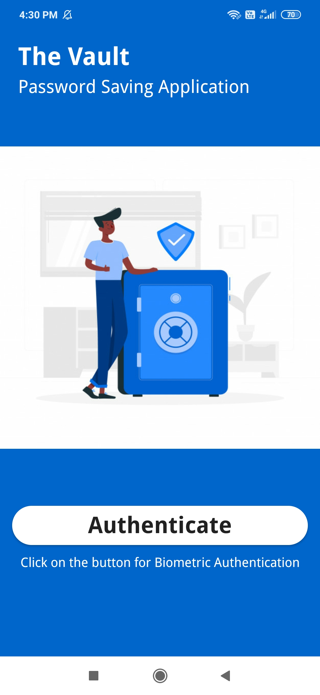
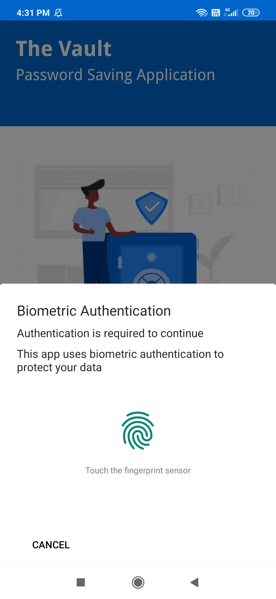
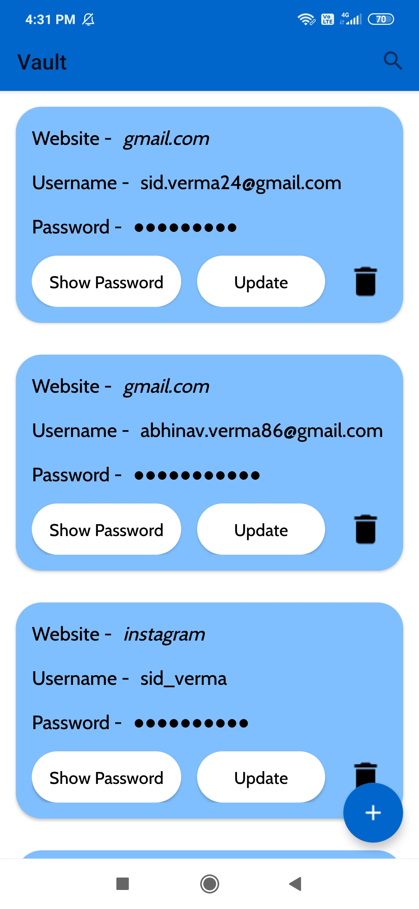
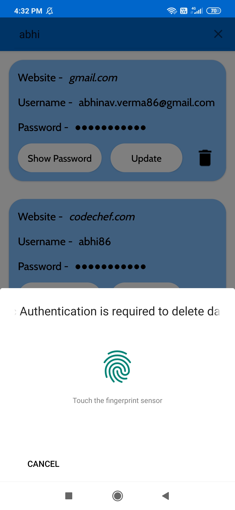
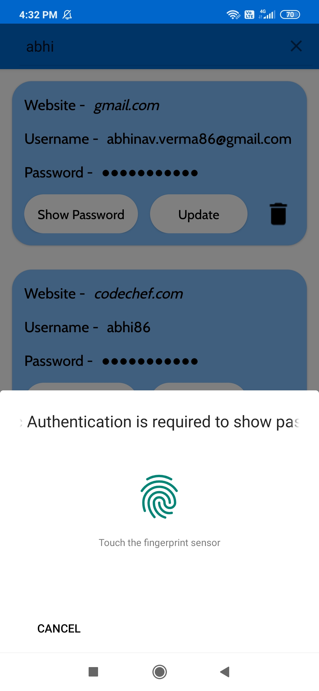
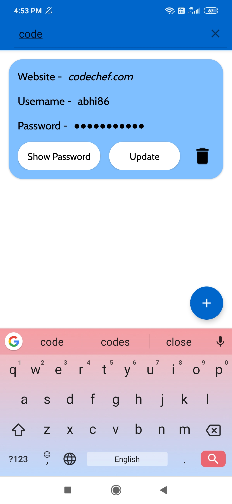

# Password-Vault
A password saving android application with biometric authentication to protect data. Biometric Authentication is required to enter into the list of saved password for a user,biometric authentication is also required to update,delete and to show password.

### Features
* Biometric Authentication
* Recycler View and Card View
* Integrating SQLite with Android
* Add, Update and Delete the password from database
* Implementation of hide and show password method 
* Implementation of filter method for adding search functionality

## Screenshots

 

